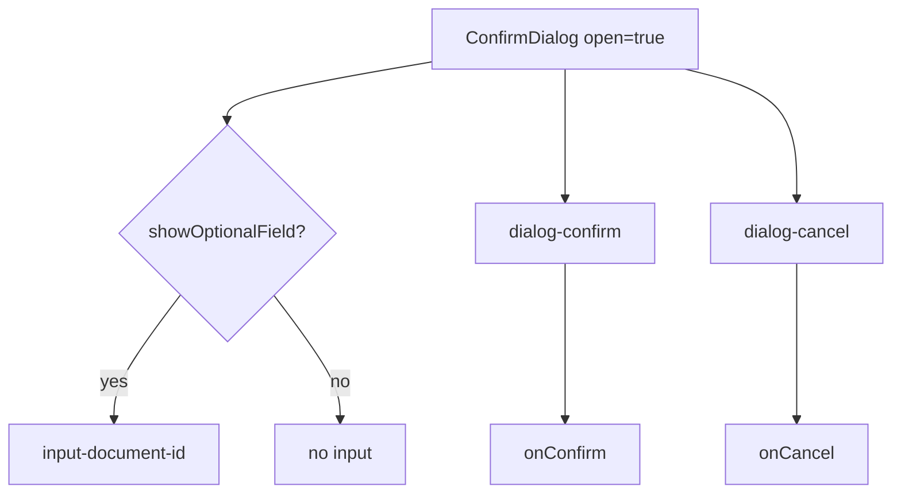

# Component Test — ConfirmDialog

This guide explains React component tests for the confirmation modal. The reference spec is [`ConfirmDialog.cy.jsx`](../../../../cypress/component/ConfirmDialog.cy.jsx); the implementation is in [`ConfirmDialog.jsx`](../../../../cypress/component/ConfirmDialog.jsx).

## Learning objectives

You will learn to:

- Mount isolated components with `cy.mountWithProviders`.
- Test conditional rendering via props (`showOptionalField`).
- Verify missing elements with `assertHookMissing`.
- Spy on React callbacks with `cy.stub()` and Cypress aliases.

## Prerequisites

- Cypress Component Testing configured (`@cypress/react18` + Vite).
- Read [selector-strategy.md](../../../selector-strategy.md) — component tests use `data-cy-hook`.
- Basic React concepts (props, event handlers).

## E2E vs Component Test

| Aspect        | E2E                          | Component Test                    |
|---------------|------------------------------|-----------------------------------|
| Scope         | Full app in browser          | Isolated component                |
| Selector      | `getByTestId`                | `getByHook` (dual bridge)         |
| Mount         | `cy.visit`                   | `cy.mountWithProviders`           |
| Speed         | Slower                       | Faster, immediate feedback        |

Component tests are ideal for validating small UI logic before integrating into E2E flows.

## The ConfirmDialog component

Relevant props:

```javascript
ConfirmDialog({
  open,              // boolean — returns null when false
  onConfirm,         // callback on Confirm click
  onCancel,          // callback on Cancel click
  showOptionalField, // shows Document ID input
  title = 'Confirm action',
})
```

When `open` is true, it renders a dialog with role `dialog`, aria-modal, and hooks:

- `input-document-id` — optional field
- `dialog-confirm` / `dialog-cancel` — action buttons
- `modal-overlay`, `dialog-title` — accessible structure

## mountWithProviders

```javascript
cy.mountWithProviders(
  <ConfirmDialog open showOptionalField onConfirm={() => {}} onCancel={() => {}} />
)
```

The helper wraps the component in `TestProviders` — a wrapper with `data-testid="theme-wrapper"` simulating theme/layout context. Ensures a single extension point when future tests need ThemeProvider or Router.

## Test 1: Optional field visible

```javascript
it('shows optional field when showOptionalField is true', () => {
  cy.mountWithProviders(<ConfirmDialog open showOptionalField onConfirm={() => {}} onCancel={() => {}} />)
  cy.getByHook('input-document-id').should('be.visible')
})
```

**Pattern:** boolean prop → conditional element present. Use `be.visible` (not just `exist`) when CSS display matters.

## Test 2: Field hidden by default

```javascript
it('hides optional field by default', () => {
  cy.mountWithProviders(<ConfirmDialog open onConfirm={() => {}} onCancel={() => {}} />)
  cy.assertHookMissing('input-document-id')
})
```

`assertHookMissing` runs `cy.getByHook(hook).should('not.exist')` — confirms React did not mount the node (conditional render `{showOptionalField && ...}`).

**Anti-pattern:** do not test `display: none` when the element should not exist in the DOM at all.

## Test 3: onConfirm callback

```javascript
it('calls onConfirm when confirm clicked', () => {
  const onConfirm = cy.stub().as('onConfirm')
  cy.mountWithProviders(<ConfirmDialog open onConfirm={onConfirm} onCancel={() => {}} />)
  cy.clickHook('dialog-confirm')
  cy.get('@onConfirm').should('have.been.called')
})
```

### Techniques used

1. **cy.stub()** — replaces the real function; records calls.
2. **.as('onConfirm')** — alias for later assertions.
3. **clickHook** — abstraction over `getByHook().click()`.

This test validates the parent-child contract without rendering the full page.

## Selectors: getByHook

```javascript
cy.get(`[data-cy-hook="${hook}"], [data-testid="${hook}"]`)
```

Tries `data-cy-hook` first with fallback to `data-testid` — useful when slides and the real app differ nominally.

## How to run

```bash
# Open CT in the browser
npm run cy:open:component

# Headless — all component tests
npm run cy:run:component

# ConfirmDialog only
npx cypress run --component --spec 'cypress/component/ConfirmDialog.cy.jsx'
```

## Suggested extensions

Scenarios not covered in the current spec (practice opportunities):

1. Click Cancel and assert `onCancel` was called.
2. `open={false}` → overlay does not exist.
3. Type in `input-document-id` when visible.
4. Accessibility test with `cypress-axe` on the open dialog.

## Props → DOM diagram



## Best practices

1. **Minimal props** — pass only what is needed; empty callbacks `() => {}` when irrelevant.
2. **One behavior per it** — easier CI diagnosis.
3. **Named stubs** — alias `@onConfirm` readable in reports.
4. **Stable hooks** — prefer `data-cy-hook` on training components.

## Practical exercises

1. Add a test that verifies a custom title via the `title` prop.
2. Implement an Escape key test (if the component supports it) closing the dialog.
3. Compare CT vs equivalent E2E execution time on the login modal.
4. Refactor empty callbacks to `cy.stub()` for `onCancel` in existing tests too.

## References

- Spec: [`cypress/component/ConfirmDialog.cy.jsx`](../../../../cypress/component/ConfirmDialog.cy.jsx)
- Component: [`cypress/component/ConfirmDialog.jsx`](../../../../cypress/component/ConfirmDialog.jsx)
- Mount helper: [`cypress/support/component/mountWithProviders.jsx`](../../../../cypress/support/component/mountWithProviders.jsx)
- CT commands: [`cypress/support/component.js`](../../../../cypress/support/component.js)
