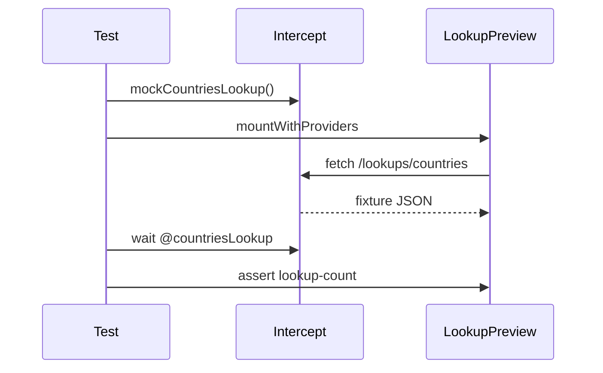

# Component Test — LookupPreview

This module teaches how to test components that fetch data via `fetch`, mocking the API with Cypress intercepts. Spec: [`LookupPreview.cy.jsx`](../../../../cypress/component/LookupPreview.cy.jsx).

## Learning objectives

When you finish, you will be able to:

- Mount components with async effects (`useEffect` + fetch).
- Register intercept before mount to avoid race conditions.
- Synchronize tests with `cy.wait('@alias')`.
- Validate text derived from JSON fixture payload.

## Prerequisites

- ConfirmDialog.md (concepts of `mountWithProviders` and `getByHook`).
- Fixture [`lookups/countries.json`](../../../../cypress/fixtures/lookups/countries.json).
- Custom command `mockCountriesLookup`.

## The LookupPreview component

```javascript
export function LookupPreview() {
  const [label, setLabel] = useState('Loading…')

  useEffect(() => {
    fetch('/lookups/countries')
      .then((res) => res.json())
      .then((data) => {
        const count = data.countries?.length ?? 0
        setLabel(`${count} countries`)
      })
      .catch(() => setLabel('Lookup failed'))
  }, [])

  return <span data-cy-hook="lookup-count">{label}</span>
}
```

Behavior:

1. Initial render: `"Loading…"`.
2. After successful fetch: `"N countries"` where N = array length.
3. On network error: `"Lookup failed"`.

The test focuses on the happy path with mock — three countries in the fixture → `"3 countries"`.

## countries fixture

```json
{
  "countries": [
    { "code": "CA", "name": "Canada" },
    { "code": "US", "name": "United States" },
    { "code": "BR", "name": "Brazil" }
  ]
}
```

Three entries drive the `contain.text, '3 countries'` assertion.

## mockCountriesLookup command

```javascript
Cypress.Commands.add('mockCountriesLookup', () =>
  cy.intercept('GET', '**/lookups/countries**', { fixture: 'lookups/countries' }).as('countriesLookup'),
)
```

- **Glob URL** — `**/lookups/countries**` matches relative and absolute paths.
- **fixture** — Cypress serves JSON from `cypress/fixtures/lookups/countries.json`.
- **alias** — `@countriesLookup` for explicit wait.

## Test anatomy

```javascript
it('loads countries count from mocked lookup API', () => {
  cy.mockCountriesLookup()
  cy.mountWithProviders(<LookupPreview />)
  cy.wait('@countriesLookup')
  cy.getByHook('lookup-count').should('contain.text', '3 countries')
})
```

### Critical order



1. **Intercept first** — if you mount before, fetch may hit the real network or fail.
2. **Mount** — triggers useEffect and fetch.
3. **Wait** — ensures mocked response before assert.
4. **Assert** — final React state reflected in the span.

Without `cy.wait`, the test may pass flaky (Loading…) or fail intermittently.

## Component Test vs E2E intercept

The same `mockCountriesLookup` pattern appears in users.api (Activity page) with `mockApiGet`. The difference:

| CT LookupPreview     | E2E Activity                    |
|----------------------|---------------------------------|
| Isolated component   | Page + fetch button             |
| fetch in useEffect   | click triggers request          |
| Direct text assert   | Assert on `api-result`          |

Learning CT first simplifies debugging — fewer moving parts.

## How to run

```bash
npm run cy:open:component
# Select LookupPreview.cy.jsx

npx cypress run --component --spec 'cypress/component/LookupPreview.cy.jsx'
```

## Scenarios to expand

Happy path only. Practice: `forceNetworkError` → `"Lookup failed"`; stub `{ countries: [] }` → `"0 countries"`; assert `"Loading…"` before wait; HTTP 500 on intercept. If `wait` times out, register intercept **before** mount.

In users.api, `cy.task('readFixture', 'lookups/countries.json')` validates the same fixture in Node — complementary coverage.

## Best practices

Descriptive alias (`@countriesLookup`), lean fixtures, flexible `contain.text`, and optional chaining in the component (`data.countries?.length ?? 0`).

## References

- Spec: [`cypress/component/LookupPreview.cy.jsx`](../../../../cypress/component/LookupPreview.cy.jsx)
- Component: [`cypress/component/LookupPreview.jsx`](../../../../cypress/component/LookupPreview.jsx)
- Fixture: [`cypress/fixtures/lookups/countries.json`](../../../../cypress/fixtures/lookups/countries.json)
- Intercept command: [`cypress/support/component.js`](../../../../cypress/support/component.js)
