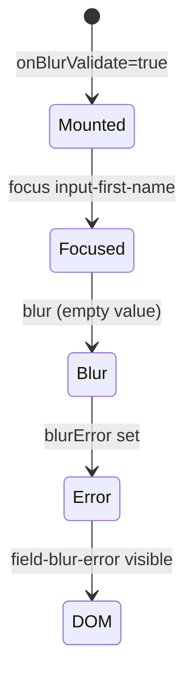

# Component Test — UserForm

This guide covers form validation, error/help messages, and blur validation. Spec: [`UserForm.cy.jsx`](../../../../cypress/component/UserForm.cy.jsx).

## Learning objectives

You will learn to:

- Test multiple UI variants via a case table (`validationCases`).
- Validate static and dynamic error messages (blur).
- Simulate focus/blur interaction on controlled inputs.
- Confirm theme wrapper integration via `mountWithProviders`.

## Prerequisites

- ConfirmDialog.md and UserBadge.md (parameterization and hooks).
- `UserForm` component exported from [`ConfirmDialog.jsx`](../../../../cypress/component/ConfirmDialog.jsx).

## The UserForm component

Props:

```javascript
UserForm({
  showDocumentId = false,
  errorMessage = '',
  onBlurValidate = false,
})
```

Elements and hooks:

| Hook                  | When it appears                             |
|-----------------------|---------------------------------------------|
| `input-first-name`    | Always                                      |
| `input-last-name`     | Always                                      |
| `input-document-id`   | `showDocumentId === true`                   |
| `field-error-message` | `errorMessage` non-empty                    |
| `field-blur-error`    | After blur with empty field + onBlurValidate|
| `field-help-text`     | Always ("Help text")                        |

Internal `blurError` state managed by `useState` — activated only with `onBlurValidate`.

## Parameterization: validationCases

```javascript
const validationCases = [
  {
    props: { showDocumentId: true, errorMessage: 'This field is mandatory' },
    hook: 'field-error-message',
    text: 'mandatory',
  },
  {
    props: { showDocumentId: false, errorMessage: '' },
    hook: 'field-help-text',
    text: 'Help text',
  },
]

validationCases.forEach(({ props, hook, text }) => {
  it(`renders ${hook} with expected copy`, () => {
    cy.mountWithProviders(<UserForm {...props} />)
    cy.getByHook(hook).should('contain.text', text)
  })
})
```

### Case 1: Mandatory error

- `showDocumentId: true` — document field visible (full form context).
- `errorMessage` propagates to `field-error-message` span.
- Partial assert `'mandatory'` — flexible substring match.

### Case 2: Default help text

- No errorMessage — error span does not render.
- Help text always present — user guidance independent of errors.

**Spread props `{...props}`** — idiomatic React pattern in tests.

## Blur validation

```javascript
it('shows blur validation error when first name is empty', () => {
  cy.mountWithProviders(<UserForm onBlurValidate />)
  cy.getByHook('input-first-name').focus().blur()
  cy.getByHook('field-blur-error').should('contain.text', 'required on blur')
})
```

### Interaction flow



1. `onBlurValidate` prop enables `handleBlur` handler.
2. Empty field after blur → `setBlurError('This field is required on blur')`.
3. Assert searches for substring `'required on blur'`.

### focus().blur() chain

Equivalent to a user tabbing through the field without typing. Cypress serializes commands in the same chain — ensures order before assert.

### Untested path (exercise)

Type text before blur → `blurError` cleared → `assertHookMissing('field-blur-error')`.

## Theme provider wrapper

```javascript
it('renders inside theme provider wrapper', () => {
  cy.mountWithProviders(<UserForm />)
  cy.getByTestId('theme-wrapper').should('exist')
})
```

Validates that `mountWithProviders` wraps the form — important when styles depend on the wrapper. Uses `getByTestId` because `theme-wrapper` is test infrastructure, not a product hook.

Wrapper implementation:

```javascript
<div data-testid="theme-wrapper" style={{ padding: '1rem', ... }}>
  {children}
</div>
```

## Comparison: prop error vs blur error

| Type              | Source                    | Hook                  | Trigger              |
|-------------------|---------------------------|-----------------------|----------------------|
| Prop error        | Parent passes errorMessage| field-error-message   | Initial render       |
| Blur error        | Internal state            | field-blur-error      | focus + empty blur   |

Separate tests avoid confusing server-side validation (prop) with client-side (blur).

## How to run

```bash
npx cypress run --component --spec 'cypress/component/UserForm.cy.jsx'
npm run cy:open:component
```

## Best practices demonstrated

1. **Case table** — scales to N copy/state variants.
2. **contain.text** — resilient to partial capitalization if copy changes slightly.
3. **Boolean prop shorthand** — `onBlurValidate` vs `onBlurValidate={true}`.
4. **Separate infra test** — theme-wrapper isolated from business rules.

## Relation to API and exercises

`rules.api.cy.js` tests mandatory fields on the API (`TC-0302`); UserForm covers visual feedback on the client. Exercises: fill first name and blur without error; third case in `validationCases`; a11y test with labels. If blur-error does not appear, confirm `onBlurValidate` and empty field; always use `mountWithProviders`.

## References

- Spec: [`cypress/component/UserForm.cy.jsx`](../../../../cypress/component/UserForm.cy.jsx)
- Component: [`cypress/component/ConfirmDialog.jsx`](../../../../cypress/component/ConfirmDialog.jsx) (exports UserForm)
- Mount: [`cypress/support/component/mountWithProviders.jsx`](../../../../cypress/support/component/mountWithProviders.jsx)
- Mandatory API: [`docs/en/tests/api/rules.api.md`](../api/rules.api.md)
