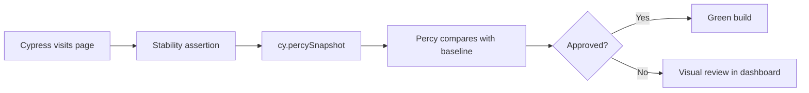

# Visual Tests with Percy

This guide explains how the TestFlow Cypress project uses **Percy** to capture visual snapshots and detect layout regressions. The reference file is [`percy.cy.js`](../../../../cypress/e2e/visual/percy.cy.js).

## Learning objectives

After completing this module, you will be able to:

- Understand the role of visual tests within a larger E2E suite.
- Configure and run Percy snapshots on public and authenticated pages.
- Use traceable test case IDs with the `tc()` helper.
- Interpret snapshot failures and know when to update baselines in Percy.

## Prerequisites

- Node.js and project dependencies installed (`npm install`).
- Percy account configured with `PERCY_TOKEN` in the environment (CI or local).
- Basic familiarity with Cypress E2E and the `cy.visit` command.
- Knowledge of the TestFlow login flow (`DEMO_EMAIL` and `DEMO_PASSWORD` in `cypress.env.json`).

## File overview

The `percy.cy.js` spec groups three visual baseline scenarios, each mapped to a test case ID in the `TC` enum:

| ID        | Scenario              | Page                    |
|-----------|----------------------|---------------------------|
| TC-9001   | Login page baseline  | `/web/login.html`         |
| TC-9002   | Dashboard baseline   | `/web/dashboard.html`     |
| TC-9003   | Components baseline  | `/web/components.html`    |

The `describe` block uses `@visual` and `@regression` tags, allowing filtered execution with `@bahmutov/cy-grep`:

```bash
npm run cy:run:visual
npm run cy:run:visual:percy   # runs with Percy CLI
```

## Test structure

### 1. Login page baseline (TC-9001)

```javascript
cy.visit('/web/login.html')
cy.getByTestId('login-email').should('be.visible')
cy.percySnapshot('Login Page')
```

This test visits the login page **without a session**. Before capturing the snapshot, it ensures the email field is visible — avoiding a blank or partially loaded screen.

**Why wait for visibility?** Snapshots taken too early cause false positives when CSS or fonts have not finished loading. The visibility assertion acts as a stability gate.

### 2. Dashboard baseline (TC-9002)

```javascript
cy.visitWithSession('/web/dashboard.html')
cy.getByTestId('page-dashboard').should('exist')
cy.percySnapshot('Dashboard')
```

Here the custom `cy.visitWithSession` command reuses seeded cookies or auth tokens. Protected pages require a session; without it, Percy would capture the login redirect screen.

The `page-dashboard` selector confirms the main page container is mounted in the DOM.

### 3. Components page baseline (TC-9003)

```javascript
cy.visitWithSession('/web/components.html')
cy.getByTestId('page-components').should('exist')
cy.percySnapshot('Components Page')
```

Follows the same pattern as the dashboard: session + anchor element + snapshot. The components page concentrates diverse widgets — ideal for detecting visual breaks in cards, buttons, and tables.

## Key concepts

### Percy vs native Cypress screenshots

Cypress can save local screenshots with `cy.screenshot()`, but **Percy** compares each capture against versioned baselines in the cloud. When pixel differences exceed the configured threshold, the Percy build fails and requires human review (approve or reject).

### Snapshot naming

Each `cy.percySnapshot('Name')` call defines a readable identifier in the Percy dashboard. Use stable, descriptive names; avoid timestamps or dynamic strings that make history hard to follow.

### Tags and traceability

- `@visual` — marks visual specs and cases for selective execution.
- `@regression` — includes the file in the full regression suite.
- `tc(TC.VISUAL_*, '...')` — prefixes the test title with a traceable ID (Jira/Xray).

### E2E selectors

For visual tests against the real TestFlow app, prefer `cy.getByTestId()` with `data-testid` attributes. See [selector-strategy.md](../../../selector-strategy.md) for the distinction between E2E and component tests.

## How to run

### Locally (without Percy)

```bash
npm run cy:run:visual
```

Useful for validating that tests pass (visits, selectors, session) without uploading snapshots.

### With Percy CLI

```bash
export PERCY_TOKEN=your_token_here
npm run cy:run:visual:percy
```

The `percy exec --` command wraps `cypress run` and uploads captures.

### Interactive mode

```bash
npm run cy:open
# Navigate to e2e/visual/percy.cy.js
```

Ideal for debugging selectors or timing before running in CI.

## Recommended CI flow



## Points of attention

1. **Dynamic data** — timestamps, random avatars, and continuous animations cause diffs. Use Percy CSS (`percyCSS`) or hide unstable elements when needed.
2. **Consistent viewport** — configure fixed width and height in `cypress.config` for comparability across runs.
3. **Flaky tests** — if snapshots fail intermittently, strengthen the stability gate (more assertions before the snapshot) instead of blindly approving diffs.
4. **Expired session** — if the dashboard snapshot shows login, verify `cy.visitWithSession` and auth seeding in `cypress/support`.

## Practical exercises

1. Add a fourth snapshot for `/web/activity.html` with ID `TC-9004` in the `testCases.js` enum.
2. Run `cy:run:visual:percy` and approve or reject the diff in the Percy dashboard.
3. Simulate a CSS change in the app and observe how Percy reports the regression.
4. Compare execution time with and without `@visual` grep in the pipeline.

## References

- Test file: [`cypress/e2e/visual/percy.cy.js`](../../../../cypress/e2e/visual/percy.cy.js)
- Test case enum: [`cypress/support/@enums/testCases.js`](../../../../cypress/support/@enums/testCases.js)
- npm script: `cy:run:visual:percy` in [`package.json`](../../../../package.json)
- Percy documentation: https://docs.percy.io/docs/cypress
