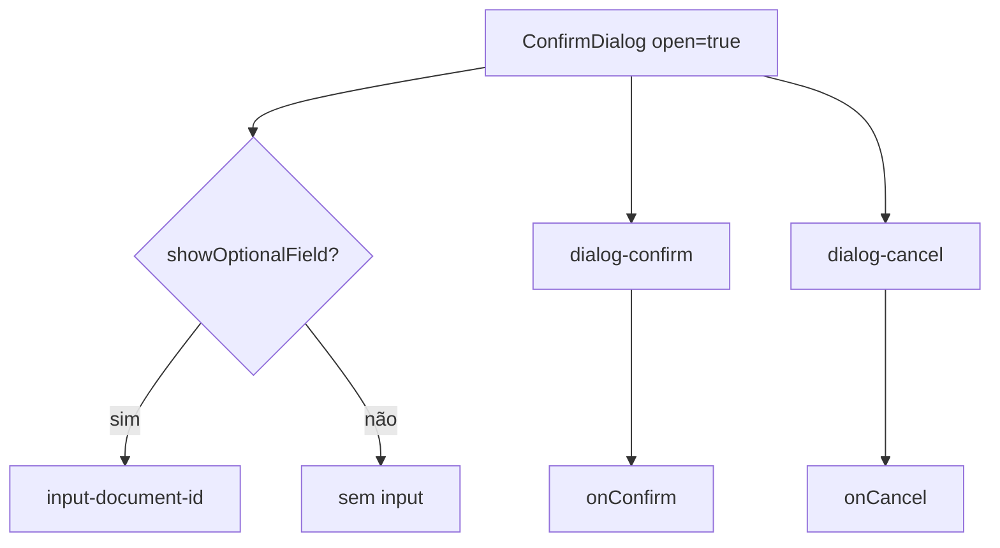

# Component Test — ConfirmDialog

Este guia explica testes de componente React para o modal de confirmação. O spec de referência é [`ConfirmDialog.cy.jsx`](../../../../cypress/component/ConfirmDialog.cy.jsx); a implementação está em [`ConfirmDialog.jsx`](../../../../cypress/component/ConfirmDialog.jsx).

## Objetivos de aprendizado

Você aprenderá a:

- Montar componentes isolados com `cy.mountWithProviders`.
- Testar renderização condicional via props (`showOptionalField`).
- Verificar ausência de elementos com `assertHookMissing`.
- Espionar callbacks React com `cy.stub()` e aliases Cypress.

## Pré-requisitos

- Cypress Component Testing configurado (`@cypress/react18` + Vite).
- Leitura de [selector-strategy.md](../../../selector-strategy.md) — component tests usam `data-cy-hook`.
- Noções básicas de React (props, event handlers).

## Diferença E2E vs Component Test

| Aspecto        | E2E                          | Component Test                    |
|----------------|------------------------------|-----------------------------------|
| Escopo         | App completo no browser      | Componente isolado                |
| Seletor        | `getByTestId`                | `getByHook` (bridge dual)         |
| Mount          | `cy.visit`                   | `cy.mountWithProviders`           |
| Velocidade     | Mais lento                   | Mais rápido, feedback imediato    |

Component tests são ideais para validar lógica de UI pequena antes de integrar no fluxo E2E.

## O componente ConfirmDialog

Props relevantes:

```javascript
ConfirmDialog({
  open,              // boolean — se false, retorna null
  onConfirm,         // callback ao clicar Confirm
  onCancel,          // callback ao clicar Cancel
  showOptionalField, // exibe input Document ID
  title = 'Confirm action',
})
```

Quando `open` é true, renderiza dialog com role `dialog`, aria-modal e hooks:

- `input-document-id` — campo opcional
- `dialog-confirm` / `dialog-cancel` — botões de ação
- `modal-overlay`, `dialog-title` — estrutura acessível

## mountWithProviders

```javascript
cy.mountWithProviders(
  <ConfirmDialog open showOptionalField onConfirm={() => {}} onCancel={() => {}} />
)
```

O helper envolve o componente em `TestProviders` — wrapper com `data-testid="theme-wrapper"` simulando contexto de tema/layout. Garante que testes futuros com ThemeProvider ou Router tenham ponto único de extensão.

## Teste 1: Campo opcional visível

```javascript
it('shows optional field when showOptionalField is true', () => {
  cy.mountWithProviders(<ConfirmDialog open showOptionalField onConfirm={() => {}} onCancel={() => {}} />)
  cy.getByHook('input-document-id').should('be.visible')
})
```

**Padrão:** prop booleana → elemento condicional presente. Use `be.visible` (não só `exist`) quando display CSS importa.

## Teste 2: Campo oculto por padrão

```javascript
it('hides optional field by default', () => {
  cy.mountWithProviders(<ConfirmDialog open onConfirm={() => {}} onCancel={() => {}} />)
  cy.assertHookMissing('input-document-id')
})
```

`assertHookMissing` executa `cy.getByHook(hook).should('not.exist')` — confirma que React não montou o nó (renderização condicional `{showOptionalField && ...}`).

**Anti-padrão:** não testar `display: none` se o elemento nem deveria existir no DOM.

## Teste 3: Callback onConfirm

```javascript
it('calls onConfirm when confirm clicked', () => {
  const onConfirm = cy.stub().as('onConfirm')
  cy.mountWithProviders(<ConfirmDialog open onConfirm={onConfirm} onCancel={() => {}} />)
  cy.clickHook('dialog-confirm')
  cy.get('@onConfirm').should('have.been.called')
})
```

### Técnicas usadas

1. **cy.stub()** — substitui função real; registra chamadas.
2. **.as('onConfirm')** — alias para asserções posteriores.
3. **clickHook** — abstração sobre `getByHook().click()`.

Este teste valida contrato pai-filho sem renderizar página inteira.

## Seletores: getByHook

```javascript
cy.get(`[data-cy-hook="${hook}"], [data-testid="${hook}"]`)
```

Tenta `data-cy-hook` primeiro e fallback para `data-testid` — útil quando slides e app real divergem nominalmente.

## Como executar

```bash
# Abrir CT no browser
npm run cy:open:component

# Headless — todos component tests
npm run cy:run:component

# Apenas ConfirmDialog
npx cypress run --component --spec 'cypress/component/ConfirmDialog.cy.jsx'
```

## Extensões sugeridas

Cenários não cobertos no spec atual (oportunidades de prática):

1. Clicar Cancel e assert `onCancel` chamado.
2. `open={false}` → overlay não existe.
3. Digitar no `input-document-id` quando visível.
4. Teste de acessibilidade com `cypress-axe` no dialog aberto.

## Diagrama de props → DOM



## Boas práticas

1. **Props mínimas** — passe só o necessário; callbacks vazios `() => {}` quando irrelevantes.
2. **Um comportamento por it** — facilita diagnóstico no CI.
3. **Stubs nomeados** — alias `@onConfirm` legível no relatório.
4. **Hooks estáveis** — prefira `data-cy-hook` em componentes de treinamento.

## Exercícios práticos

1. Adicione teste que verifica título customizado via prop `title`.
2. Implemente teste de tecla Escape (se componente suportar) fechando dialog.
3. Compare tempo de execução CT vs E2E equivalente no login modal.
4. Refatore callbacks vazios para `cy.stub()` também em `onCancel` nos testes existentes.

## Referências

- Spec: [`cypress/component/ConfirmDialog.cy.jsx`](../../../../cypress/component/ConfirmDialog.cy.jsx)
- Componente: [`cypress/component/ConfirmDialog.jsx`](../../../../cypress/component/ConfirmDialog.jsx)
- Mount helper: [`cypress/support/component/mountWithProviders.jsx`](../../../../cypress/support/component/mountWithProviders.jsx)
- Commands CT: [`cypress/support/component.js`](../../../../cypress/support/component.js)
