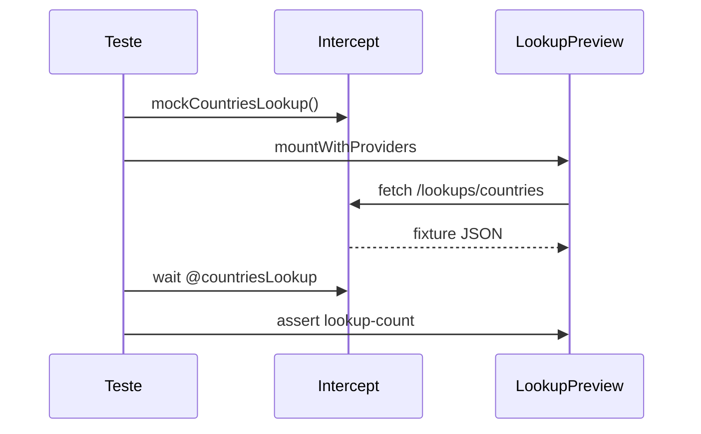

# Component Test — LookupPreview

Este módulo ensina a testar componentes que buscam dados via `fetch`, mockando a API com intercepts Cypress. Spec: [`LookupPreview.cy.jsx`](../../../../cypress/component/LookupPreview.cy.jsx).

## Objetivos de aprendizado

Ao concluir, você será capaz de:

- Montar componentes com efeitos assíncronos (`useEffect` + fetch).
- Registrar intercept antes do mount para evitar race conditions.
- Sincronizar testes com `cy.wait('@alias')`.
- Validar texto derivado de payload JSON fixture.

## Pré-requisitos

- ConfirmDialog.md (conceitos de `mountWithProviders` e `getByHook`).
- Fixture [`lookups/countries.json`](../../../../cypress/fixtures/lookups/countries.json).
- Comando customizado `mockCountriesLookup`.

## O componente LookupPreview

```javascript
export function LookupPreview() {
  const [label, setLabel] = useState('Loading…')

  useEffect(() => {
    fetch('/lookups/countries')
      .then((res) => res.json())
      .then((data) => {
        const count = data.countries?.length ?? 0
        setLabel(`${count} countries`)
      })
      .catch(() => setLabel('Lookup failed'))
  }, [])

  return <span data-cy-hook="lookup-count">{label}</span>
}
```

Comportamento:

1. Render inicial: `"Loading…"`.
2. Após fetch OK: `"N countries"` onde N = tamanho do array.
3. Em erro de rede: `"Lookup failed"`.

O teste foca no caminho feliz com mock — três países na fixture → `"3 countries"`.

## Fixture countries

```json
{
  "countries": [
    { "code": "CA", "name": "Canada" },
    { "code": "US", "name": "United States" },
    { "code": "BR", "name": "Brazil" }
  ]
}
```

Três entradas determinam a asserção `contain.text, '3 countries'`.

## Comando mockCountriesLookup

```javascript
Cypress.Commands.add('mockCountriesLookup', () =>
  cy.intercept('GET', '**/lookups/countries**', { fixture: 'lookups/countries' }).as('countriesLookup'),
)
```

- **Glob URL** — `**/lookups/countries**` casa paths relativos e absolutos.
- **fixture** — Cypress serve JSON de `cypress/fixtures/lookups/countries.json`.
- **alias** — `@countriesLookup` para wait explícito.

## Anatomia do teste

```javascript
it('loads countries count from mocked lookup API', () => {
  cy.mockCountriesLookup()
  cy.mountWithProviders(<LookupPreview />)
  cy.wait('@countriesLookup')
  cy.getByHook('lookup-count').should('contain.text', '3 countries')
})
```

### Ordem crítica



1. **Intercept primeiro** — se montar antes, fetch pode ir para rede real ou falhar.
2. **Mount** — dispara useEffect e fetch.
3. **Wait** — garante resposta mockada antes do assert.
4. **Assert** — estado final do React refletido no span.

Sem `cy.wait`, o teste pode passar flaky (Loading…) ou falhar intermitentemente.

## Component Test vs E2E intercept

O mesmo padrão `mockCountriesLookup` aparece em users.api (Activity page) com `mockApiGet`. A diferença:

| CT LookupPreview     | E2E Activity                    |
|----------------------|---------------------------------|
| Componente isolado   | Página + botão fetch            |
| fetch no useEffect   | click dispara request           |
| Assert texto direto  | Assert em `api-result`          |

Aprender CT primeiro simplifica debug — menos moving parts.

## Como executar

```bash
npm run cy:open:component
# Selecione LookupPreview.cy.jsx

npx cypress run --component --spec 'cypress/component/LookupPreview.cy.jsx'
```

## Cenários para expandir

Happy path apenas. Pratique: `forceNetworkError` → `"Lookup failed"`; stub `{ countries: [] }` → `"0 countries"`; assert `"Loading…"` antes do wait; HTTP 500 no intercept. Se `wait` der timeout, registre intercept **antes** do mount.

Em users.api, `cy.task('readFixture', 'lookups/countries.json')` valida a mesma fixture no Node — cobertura complementar.

## Boas práticas

Alias descritivo (`@countriesLookup`), fixtures enxutas, `contain.text` flexível e optional chaining no componente (`data.countries?.length ?? 0`).

## Referências

- Spec: [`cypress/component/LookupPreview.cy.jsx`](../../../../cypress/component/LookupPreview.cy.jsx)
- Componente: [`cypress/component/LookupPreview.jsx`](../../../../cypress/component/LookupPreview.jsx)
- Fixture: [`cypress/fixtures/lookups/countries.json`](../../../../cypress/fixtures/lookups/countries.json)
- Intercept command: [`cypress/support/component.js`](../../../../cypress/support/component.js)
