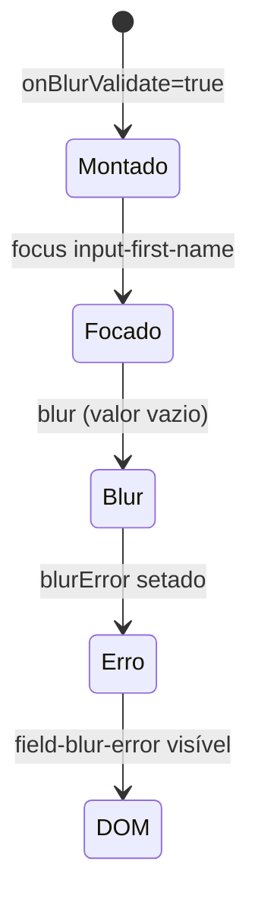

# Component Test — UserForm

Este guia cobre validação de formulário, mensagens de erro/help e blur validation. Spec: [`UserForm.cy.jsx`](../../../../cypress/component/UserForm.cy.jsx).

## Objetivos de aprendizado

Você aprenderá a:

- Testar múltiplas variantes de UI via tabela de casos (`validationCases`).
- Validar mensagens de erro estáticas e dinâmicas (blur).
- Simular interação focus/blur em inputs controlados.
- Confirmar integração com theme wrapper via `mountWithProviders`.

## Pré-requisitos

- ConfirmDialog.md e UserBadge.md (parametrização e hooks).
- Componente `UserForm` exportado de [`ConfirmDialog.jsx`](../../../../cypress/component/ConfirmDialog.jsx).

## O componente UserForm

Props:

```javascript
UserForm({
  showDocumentId = false,
  errorMessage = '',
  onBlurValidate = false,
})
```

Elementos e hooks:

| Hook                  | Quando aparece                              |
|-----------------------|---------------------------------------------|
| `input-first-name`    | Sempre                                      |
| `input-last-name`     | Sempre                                      |
| `input-document-id`   | `showDocumentId === true`                   |
| `field-error-message` | `errorMessage` não vazio                    |
| `field-blur-error`    | Após blur com campo vazio + onBlurValidate  |
| `field-help-text`     | Sempre ("Help text")                        |

Estado interno `blurError` gerenciado por `useState` — ativado só com `onBlurValidate`.

## Parametrização: validationCases

```javascript
const validationCases = [
  {
    props: { showDocumentId: true, errorMessage: 'This field is mandatory' },
    hook: 'field-error-message',
    text: 'mandatory',
  },
  {
    props: { showDocumentId: false, errorMessage: '' },
    hook: 'field-help-text',
    text: 'Help text',
  },
]

validationCases.forEach(({ props, hook, text }) => {
  it(`renders ${hook} with expected copy`, () => {
    cy.mountWithProviders(<UserForm {...props} />)
    cy.getByHook(hook).should('contain.text', text)
  })
})
```

### Caso 1: Erro mandatory

- `showDocumentId: true` — campo documento visível (contexto de formulário completo).
- `errorMessage` propaga para span `field-error-message`.
- Assert parcial `'mandatory'` — substring match flexível.

### Caso 2: Help text padrão

- Sem errorMessage — span de erro não renderiza.
- Help text sempre presente — orientação ao usuário independente de erro.

**Spread props `{...props}`** — padrão idiomático React nos testes.

## Blur validation

```javascript
it('shows blur validation error when first name is empty', () => {
  cy.mountWithProviders(<UserForm onBlurValidate />)
  cy.getByHook('input-first-name').focus().blur()
  cy.getByHook('field-blur-error').should('contain.text', 'required on blur')
})
```

### Fluxo de interação



1. `onBlurValidate` prop habilita handler `handleBlur`.
2. Campo vazio após blur → `setBlurError('This field is required on blur')`.
3. Assert busca substring `'required on blur'`.

### Cadeia focus().blur()

Equivalente a usuário tabbing pelo campo sem digitar. Cypress serializa comandos na mesma cadeia — garante ordem antes do assert.

### Caminho não testado (exercício)

Digitar texto antes do blur → `blurError` limpo → `assertHookMissing('field-blur-error')`.

## Theme provider wrapper

```javascript
it('renders inside theme provider wrapper', () => {
  cy.mountWithProviders(<UserForm />)
  cy.getByTestId('theme-wrapper').should('exist')
})
```

Valida que `mountWithProviders` envolve o formulário — importante quando estilos dependem do wrapper. Usa `getByTestId` porque `theme-wrapper` é infra de teste, não hook de produto.

Implementação do wrapper:

```javascript
<div data-testid="theme-wrapper" style={{ padding: '1rem', ... }}>
  {children}
</div>
```

## Comparação: erro prop vs erro blur

| Tipo              | Origem                    | Hook                  | Gatilho              |
|-------------------|---------------------------|-----------------------|----------------------|
| Erro de prop      | Pai passa errorMessage    | field-error-message   | Render inicial       |
| Erro de blur      | Estado interno            | field-blur-error      | focus + blur vazio   |

Separar testes evita confundir validação server-side (prop) com client-side (blur).

## Como executar

```bash
npx cypress run --component --spec 'cypress/component/UserForm.cy.jsx'
npm run cy:open:component
```

## Boas práticas demonstradas

1. **Tabela de casos** — escala para N variantes de copy/estado.
2. **contain.text** — resiliente a capitalização parcial se copy mudar levemente.
3. **Props boolean shorthand** — `onBlurValidate` vs `onBlurValidate={true}`.
4. **Teste de infra separado** — theme-wrapper isolado de regras de negócio.

## Relação com API e exercícios

`rules.api.cy.js` testa campos mandatory na API (`TC-0302`); UserForm cobre feedback visual no client. Exercícios: preencher first name e blur sem erro; terceiro caso em `validationCases`; teste a11y com labels. Se blur-error não aparecer, confirme `onBlurValidate` e campo vazio; use sempre `mountWithProviders`.

## Referências

- Spec: [`cypress/component/UserForm.cy.jsx`](../../../../cypress/component/UserForm.cy.jsx)
- Componente: [`cypress/component/ConfirmDialog.jsx`](../../../../cypress/component/ConfirmDialog.jsx) (export UserForm)
- Mount: [`cypress/support/component/mountWithProviders.jsx`](../../../../cypress/support/component/mountWithProviders.jsx)
- Mandatory API: [`docs/pt/tests/api/rules.api.md`](../api/rules.api.md)
