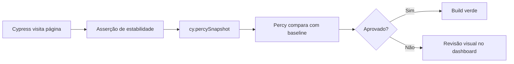

# Testes visuais com Percy

Este guia explica como o projeto TestFlow Cypress usa **Percy** para capturar snapshots visuais e detectar regressões de layout. O arquivo de referência é [`percy.cy.js`](../../../../cypress/e2e/visual/percy.cy.js).

## Objetivos de aprendizado

Ao concluir este módulo, você será capaz de:

- Entender o papel dos testes visuais dentro de uma suíte E2E maior.
- Configurar e executar snapshots Percy em páginas públicas e autenticadas.
- Usar IDs de caso de teste rastreáveis com o helper `tc()`.
- Interpretar falhas de snapshot e saber quando atualizar baselines no Percy.

## Pré-requisitos

- Node.js e dependências do projeto instaladas (`npm install`).
- Conta Percy configurada com `PERCY_TOKEN` no ambiente (CI ou local).
- Familiaridade básica com Cypress E2E e com o comando `cy.visit`.
- Conhecimento do fluxo de login do TestFlow (variáveis `DEMO_EMAIL` e `DEMO_PASSWORD` em `cypress.env.json`).

## Visão geral do arquivo

O spec `percy.cy.js` agrupa três cenários de baseline visual, cada um mapeado a um ID de caso de teste no enum `TC`:

| ID        | Cenário              | Página                    |
|-----------|----------------------|---------------------------|
| TC-9001   | Login page baseline  | `/web/login.html`         |
| TC-9002   | Dashboard baseline   | `/web/dashboard.html`     |
| TC-9003   | Components baseline  | `/web/components.html`    |

O bloco `describe` usa as tags `@visual` e `@regression`, permitindo filtrar a suíte com `@bahmutov/cy-grep`:

```bash
npm run cy:run:visual
npm run cy:run:visual:percy   # executa com Percy CLI
```

## Estrutura dos testes

### 1. Login page baseline (TC-9001)

```javascript
cy.visit('/web/login.html')
cy.getByTestId('login-email').should('be.visible')
cy.percySnapshot('Login Page')
```

Este teste visita a página de login **sem sessão**. Antes de capturar o snapshot, ele garante que o campo de e-mail esteja visível — evitando registrar uma tela em branco ou em carregamento parcial.

**Por que esperar visibilidade?** Snapshots tirados cedo demais geram falsos positivos quando o CSS ou fontes ainda não terminaram de carregar. A asserção de visibilidade funciona como gate de estabilidade.

### 2. Dashboard baseline (TC-9002)

```javascript
cy.visitWithSession('/web/dashboard.html')
cy.getByTestId('page-dashboard').should('exist')
cy.percySnapshot('Dashboard')
```

Aqui entra o comando customizado `cy.visitWithSession`, que reutiliza cookies ou token de autenticação já seedados. Páginas protegidas exigem sessão; sem ela, o Percy capturaria a tela de redirect para login.

O seletor `page-dashboard` confirma que o container principal da página foi montado no DOM.

### 3. Components page baseline (TC-9003)

```javascript
cy.visitWithSession('/web/components.html')
cy.getByTestId('page-components').should('exist')
cy.percySnapshot('Components Page')
```

Segue o mesmo padrão do dashboard: sessão + elemento âncora + snapshot. A página de componentes concentra widgets diversos — ideal para detectar quebras visuais em cards, botões e tabelas.

## Conceitos-chave

### Percy vs. screenshot nativo do Cypress

O Cypress pode salvar screenshots locais com `cy.screenshot()`, mas o **Percy** compara cada captura com baselines versionadas na nuvem. Quando há diferença de pixels acima do threshold configurado, o build Percy falha e exige revisão humana (aprovar ou rejeitar).

### Nomenclatura dos snapshots

Cada chamada `cy.percySnapshot('Nome')` define um identificador legível no dashboard Percy. Use nomes estáveis e descritivos; evite timestamps ou strings dinâmicas que dificultem o histórico.

### Tags e rastreabilidade

- `@visual` — marca specs e casos visuais para execução seletiva.
- `@regression` — inclui o arquivo na suíte de regressão completa.
- `tc(TC.VISUAL_*, '...')` — prefixa o título do teste com ID rastreável (Jira/Xray).

### Seletores E2E

Nos testes visuais contra o app TestFlow real, prefira `cy.getByTestId()` com atributos `data-testid`. Consulte [selector-strategy.md](../../../selector-strategy.md) para a distinção entre E2E e component tests.

## Como executar

### Localmente (sem Percy)

```bash
npm run cy:run:visual
```

Útil para validar que os testes passam (visitas, seletores, sessão) sem enviar snapshots.

### Com Percy CLI

```bash
export PERCY_TOKEN=seu_token_aqui
npm run cy:run:visual:percy
```

O comando `percy exec --` envolve o `cypress run` e faz upload das capturas.

### Modo interativo

```bash
npm run cy:open
# Navegue até e2e/visual/percy.cy.js
```

Ideal para depurar seletores ou timing antes de rodar no CI.

## Fluxo recomendado no CI



## Pontos de atenção

1. **Dados dinâmicos** — timestamps, avatares aleatórios e animações contínuas causam diffs. Use Percy CSS (`percyCSS`) ou oculte elementos instáveis quando necessário.
2. **Viewport consistente** — configure largura e altura fixas em `cypress.config` para comparabilidade entre execuções.
3. **Flaky tests** — se o snapshot falha intermitentemente, aumente o gate de estabilidade (mais asserções antes do snapshot) em vez de aprovar diffs às ceadas.
4. **Sessão expirada** — se o dashboard snapshot mostrar login, verifique `cy.visitWithSession` e o seed de auth em `cypress/support`.

## Exercícios práticos

1. Adicione um quarto snapshot para `/web/activity.html` com ID `TC-9004` no enum `testCases.js`.
2. Execute `cy:run:visual:percy` e aprove ou rejeite o diff no dashboard Percy.
3. Simule uma mudança de CSS no app e observe como o Percy reporta a regressão.
4. Compare o tempo de execução com e sem `@visual` grep no pipeline.

## Referências

- Arquivo de teste: [`cypress/e2e/visual/percy.cy.js`](../../../../cypress/e2e/visual/percy.cy.js)
- Enum de casos: [`cypress/support/@enums/testCases.js`](../../../../cypress/support/@enums/testCases.js)
- Script npm: `cy:run:visual:percy` em [`package.json`](../../../../package.json)
- Documentação Percy: https://docs.percy.io/docs/cypress
